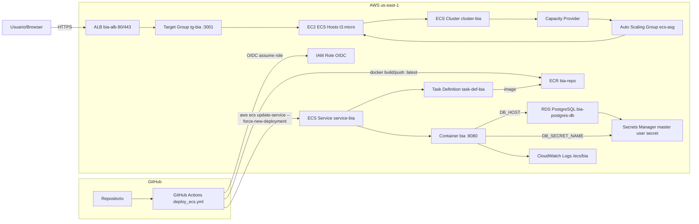
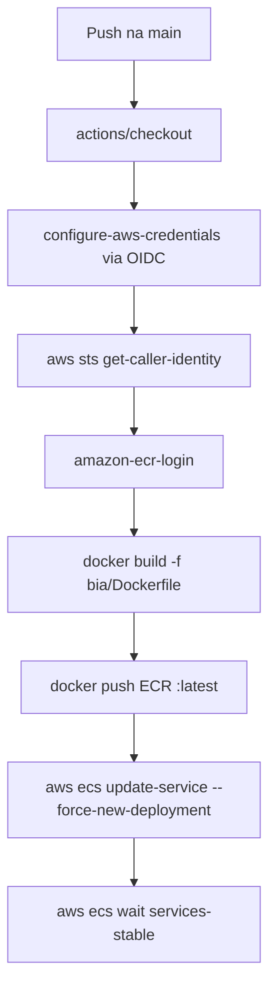

# bia_tf_pipeline_gha

Infraestrutura como código com Terraform para executar a aplicação `bia` em AWS (ECS em EC2), com deploy contínuo via GitHub Actions (OIDC + ECR + atualização do serviço ECS).

## Visão geral

Este repositório provisiona:

- VPC com subnets públicas e privadas em `us-east-1`
- Internet Gateway e tabelas de rota
- ALB com listener HTTP (redireciona para HTTPS) e listener HTTPS com certificado ACM
- ECS Cluster (`cluster-bia`) com Capacity Provider ligado a Auto Scaling Group EC2
- Task Definition e ECS Service (`service-bia`) com 2 tarefas
- ECR (`bia-repo`) para armazenar a imagem Docker
- RDS PostgreSQL (`bia-postgres-db`) com senha gerenciada no Secrets Manager
- CloudWatch Log Group (`/ecs/bia`)
- IAM Roles/Policies para EC2, ECS e tasks
- EC2 de apoio/desenvolvimento (`bia-dev`) com `user_data` para instalar Docker e Compose

## Diagrama Mermaid



### Pipeline (detalhado)



## Estrutura principal

- `main.tf`: rede base (VPC, subnets, rotas, DB subnet group)
- `alb.tf`: ALB, target group e listeners
- `ecs.tf`, `capacity_provider.tf`, `asg.tf`, `launch_ecs.tf`: cluster ECS baseado em EC2
- `task_def_bia.tf`, `ecs_service.tf`: task e serviço da aplicação
- `rds.tf`, `data_bia_db.tf`: banco e integração com secret do RDS
- `iam_role*.tf`: papéis e permissões
- `ecr.tf`: repositório de imagens
- `.github/workflows/deploy_ecs.yml`: pipeline de build/push/deploy
- `bia/`: código da aplicação e Dockerfile

## Pré-requisitos

- Terraform `>= 1.5`
- AWS CLI autenticado (perfil com permissões para criar recursos usados no projeto)
- Conta AWS na região `us-east-1`
- Domínio/certificado ACM válido para `*.rio-aws.com.br` (ou ajuste em `alb.tf`)
- GitHub Actions configurado com OIDC + secret `AWS_ROLE_TO_ASSUME`

## Como aplicar a infraestrutura

Na raiz do projeto:

```bash
terraform init
terraform fmt -recursive
terraform validate
terraform plan 
terraform apply
```

Para destruir:

```bash
terraform destroy
```

## Variáveis

As variáveis estão em `variables.tf`:

- `vpc_cidr`
- `subnets_public`
- `subnets_private`

Se quiser adaptar para outro ambiente/região, ajuste:

- `provider "aws"` em `providers.tf`
- subnets/CIDRs em `terraform.tfvars`
- domínio/certificado ACM em `alb.tf`

## Outputs úteis

Após `apply`:

- `alb_dns`: DNS público do ALB
- `rds_endpoint`: endpoint do PostgreSQL
- `repo_url`: URL do ECR
- `instance_id` e `ip_instance`: EC2 de apoio
- `secret_name`: nome do secret gerado para o master user do RDS

Comando:

```bash
terraform output
```

## Pipeline de deploy (GitHub Actions)

Workflow: `.github/workflows/deploy_ecs.yml`

Disparo:

- push na branch `main`
- execução manual (`workflow_dispatch`)

Fluxo:

1. Assume role AWS via OIDC (`aws-actions/configure-aws-credentials`)
2. Descobre `account_id`
3. Login no ECR
4. Build da imagem com `bia/Dockerfile`
5. Push da tag `latest` para `bia-repo`
6. `aws ecs update-service --force-new-deployment`
7. Espera o serviço estabilizar

Variáveis de ambiente do workflow:

- `AWS_REGION=us-east-1`
- `ECR_REPOSITORY=bia-repo`
- `ECS_CLUSTER=cluster-bia`
- `ECS_SERVICE=service-bia`

## Execução local da aplicação

A aplicação está em `bia/`. Consulte também `bia/README.md`.

Exemplo para migrations (no container):

```bash
docker compose exec server bash -c 'npx sequelize db:migrate'
```

## Observações importantes

- O task definition usa imagem `:latest`; para ambientes mais controlados, prefira tag imutável (ex.: SHA do commit).
- O target group está em `port 3001`, enquanto o container expõe `containerPort 8080` com `hostPort 0` em modo `bridge`. Valide se esse mapeamento está conforme o comportamento esperado no seu cluster EC2.
- Há arquivos de estado local (`terraform.tfstate`); idealmente use backend remoto (S3 + DynamoDB) para colaboração e locking.

## Próximos passos recomendados

- Configurar backend remoto do Terraform
- Adicionar ambientes (`dev`, `stg`, `prod`) com `workspaces` ou separação por diretórios
- Versionar imagem por commit SHA no pipeline

